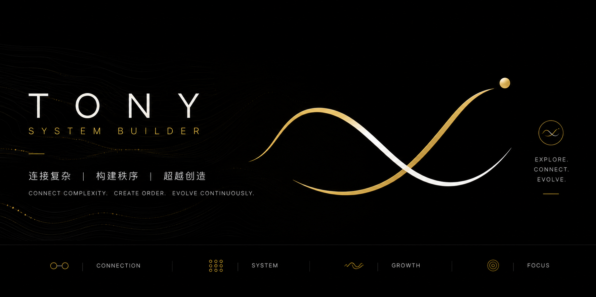

<div align="center">



<h1>ContextCanopy</h1>

<p><strong>Switch agents. Keep your context.</strong></p>

<p>
  A portable, local-first memory and context layer for personal AI:<br />
  one human, many agents, no memory lock-in.
</p>

<p>
  <a href="https://github.com/YusenZhang0601/context-canopy/actions/workflows/ci.yml"></a>
  <a href="https://github.com/YusenZhang0601/context-canopy/releases/latest"></a>
  <a href="LICENSE"></a>
  <a href="https://modelcontextprotocol.io"></a>
  <a href="https://obsidian.md"></a>
  
</p>

<p>
  <a href="#why-contextcanopy">Why?</a> ·
  <a href="#proof-not-promise">Proof</a> ·
  <a href="#quick-start">Quick start</a> ·
  <a href="#what-ships-in-v100">Features</a> ·
  <a href="README.zh-CN.md">简体中文</a>
</p>

</div>

---

## Why ContextCanopy?

The better an AI agent remembers you, the harder it becomes to leave.

Preferences, project history, vocabulary, decisions, working style, and long-term goals accumulate inside chats and provider memory. A better agent appears, but switching means teaching it who you are all over again. Your memory becomes accidental vendor lock-in.

**ContextCanopy makes durable context user-owned infrastructure.**

| Without it | With ContextCanopy |
|---|---|
| Every agent builds a separate version of you. | Agents meet the same evidence-backed person. |
| Switching means rebuilding months of context. | A new host attaches to the same portable core. |
| Memory hides in chats, caches, and provider state. | Durable context is inspectable Markdown. |
| Shared memory can flatten every agent into one role. | Common context and agent-specific roles stay separate. |

> ContextCanopy does not move a model's hidden mind. It moves the durable context that should belong to you.

## How portability works

```text
 chats · exports · notes · research · decisions
                       │
              Capture / Learn / Distill
                       │
           ┌───────────▼───────────┐
           │  CONTEXTCANOPY CORE   │
           │ identity · knowledge │
           │ goals · rules · proof│
           └──────┬────────┬───────┘
                  │        │
            Attach + Sync  │
                  │        │
               Claude    Codex    future agents
               own role  own role  own role
```

The core has three explicit layers:

1. **Evidence** — immutable source material: conversations, papers, manuals, and exports.
2. **Canonical context** — atomic knowledge, preferences, decisions, and long-term directions with one owner, sources, relations, and honest freshness.
3. **Host projections** — shared user rules plus a distinct role for each agent, delivered through Agent Skills and a thin local MCP bridge.

It is closer to a **passport for your context** than a giant system prompt: portable identity and history, with each agent retaining its own job.

## Proof, not promise

`npm run smoke` copies the seed Vault, starts one fresh MCP process as Claude, captures a disposable knowledge card, shuts that process down, then starts a second process as Codex. Codex must load the same common rules, keep a different role, discover the card, and read it back. The compiler runs before and after, and SHA-256 guards prove the original Vault stayed byte-identical.

```json
{
  "success": true,
  "cross_agent_handoff": {
    "source_agent": "claude",
    "target_agent": "codex",
    "fresh_server_processes": 2,
    "shared_common_rules": true,
    "distinct_agent_profiles": true,
    "entry_found_by_target": true,
    "entry_read_by_target": true
  },
  "copied_vault_compiler_check": "passed",
  "live_vault_unchanged": true,
  "temporary_copy_removed": true
}
```

This proves the portable core across isolated local client lifecycles. It does **not** claim universal import from closed provider-native memory.

## Quick start

### Requirements

- Node.js 18+
- Python 3.10+ with PyYAML (`python3 -m pip install pyyaml`)
- GitHub CLI for the recommended private-template bootstrap
- Obsidian is optional; any Markdown editor works

### 1. Create a safe personal authority

Do this **before** adding personal information. The recommended path creates a separate private repository and clones it as your only writable `origin`:

```bash
gh repo create my-context-canopy +  --private +  --template YusenZhang0601/context-canopy +  --clone
cd my-context-canopy
git remote add upstream https://github.com/YusenZhang0601/context-canopy.git

gh repo view --json nameWithOwner,visibility
git remote -v
```

Confirm that `visibility` is `PRIVATE` and that `origin` points to your private repository. You can also use GitHub's **Use this template** button and select **Private**.

For a local-only setup, disable public pushes explicitly:

```bash
git clone https://github.com/YusenZhang0601/context-canopy.git
cd context-canopy
git remote rename origin upstream
git remote set-url --push upstream DISABLED
git remote -v
```

Never use a public fork as a personal Vault.

### 2. Install and verify

```bash
python3 -m pip install pyyaml
npm ci --prefix mcp
npm test
npm run smoke
```

The v1.0.0 MCP package is installed from this repository's `mcp/` source; it is not advertised as an npm-published package.

### 3. Attach an agent

Open the repository root in a compatible agent and send:

```text
Read AGENTS.md and skills/second-brain-attach/SKILL.md, then attach this host to ContextCanopy.
Do not write personal information until the private or local-only authority is verified.
Install the bundled Skills, configure the local MCP server, run the documented checks,
and finish with a fresh-session Doctor check. Report only what was actually verified.
```

## What ships in v1.0.0

| Capability | Included |
|---|---|
| Portable continuity | User-owned Markdown authority shared across independent agents |
| Bounded learning | Evidence-backed Learn and Distill workflows with protected identity, privacy, and permission boundaries |
| Distinct agents | Shared user rules plus separate Claude, Codex, AntiGravity, and Hermes roles |
| Compiled knowledge graph | Atomic owners, typed relations, freshness, backlinks, provenance, and deterministic views |
| Local MCP bridge | 9 allowlisted tools for knowledge, personal-AI authority, and Skill discovery |
| Agent workflows | 8 Skills for capture, attach, sync, learn, distill, climb, doctor, and help |
| Reversible capture | Canonical writes, reciprocal links, review records, compilation, and rollback in one transaction |
| Isolated migration proof | Reproducible Claude → ContextCanopy → Codex two-process smoke |

<details>
<summary><strong>Show the 8 Skills and 9 MCP tools</strong></summary>

**Skills:** `capture-knowledge`, `second-brain-attach`, `second-brain-sync`, `second-brain-learn`, `second-brain-distill`, `second-brain-climb`, `second-brain-doctor`, `second-brain-help`.

**MCP tools:** `search_knowledge`, `get_entry`, `list_entries`, `capture_from_conversation`, `get_common_rules`, `get_agent_profile`, `get_mountain_context`, `list_second_brain_skills`, `read_second_brain_skill`.

</details>

### What moves—and what does not

| Portable by design | Not claimed as portable |
|---|---|
| Preferences, terminology, rules, and agent roles | Model weights or hidden provider internals |
| Canonical knowledge, decisions, and provenance | Credentials, permissions, or secrets |
| Long-term goals and evidence-backed progress | A live chat's transient runtime state |
| Accessible exports, selected conversations, and notes | Memory a provider does not expose |
| Reusable Skills and host projections | Unsupported host UI settings |

## Where it fits

ContextCanopy is not trying to be another hosted vector-memory API or a LifeOS dashboard. Its center is **migration of a person's governed context across independent agents**.

| Adjacent category | ContextCanopy's distinction |
|---|---|
| Provider memory | User-owned context that can outlive one product |
| Vector / graph memory | Human-readable authority and evidence, not only retrieval |
| Cross-agent coding memory | Personal continuity beyond project facts |
| Stateful agent platforms | Continuity across agents rather than one agent's internal state |
| Obsidian / LifeOS templates | Agent-operable context substrate rather than a planning UI |

See the dated [project landscape](docs/landscape.md) for comparisons with Basic Memory, AgentCairn, Memorix, AMP, Mem0, Graphiti, Letta, LifeOS, and related work.

## Validation

```bash
# Vault compiler, linter, and MCP tests
npm test

# Two-process cross-agent handoff on a disposable full-Vault copy
npm run smoke

# Package and dependency hygiene
cd mcp
node --check index.js
node --check lib/vault-writer.js
npm pack --dry-run
npm audit --audit-level=low
```

CI runs at the declared minimums: Node.js 18 and Python 3.10.

## Honest limits

- Historical migration is guided and source-preserving; universal one-click provider import is not included.
- Every real host still needs its own fresh-session attachment proof.
- The canonical layer is plaintext, not encrypted storage. Use private remotes, filesystem permissions, encrypted backups, and secret hygiene.
- Search is intentionally simple in v1.0.0. Optional disposable indexes may be added later without replacing Markdown authority.

## Project name and compatibility

**ContextCanopy** is the public brand. The v1 line retains `second-brain-*` Skill IDs and `SECOND_BRAIN_*` environment variables as compatibility namespaces.

## Contributing

The most useful contributions are preview-first import adapters, fresh-host recipes, migration fixtures, adversarial filesystem tests, and simpler onboarding.

If memory lock-in has stopped you from trying a better agent, [tell us which context source should move first](https://github.com/YusenZhang0601/context-canopy/issues/new?template=feature_request.yml). Read [CONTRIBUTING.md](CONTRIBUTING.md), follow the [Code of Conduct](CODE_OF_CONDUCT.md), and report vulnerabilities through [SECURITY.md](SECURITY.md).

## License

[MIT](LICENSE) © 2026 [TonyRainforest](https://github.com/YusenZhang0601).

<div align="center">

**Your agents are replaceable. Your context is yours.**

Built by **TonyRainforest · System Builder**<br />
Connect complexity. Create order. Evolve continuously.

</div>
